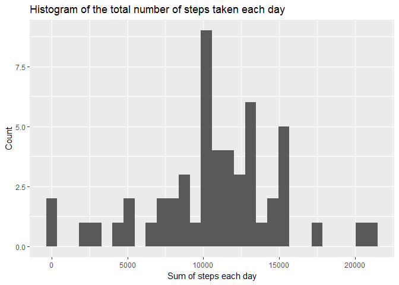
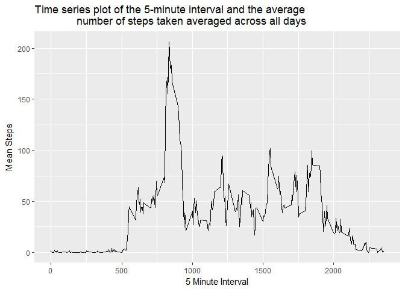
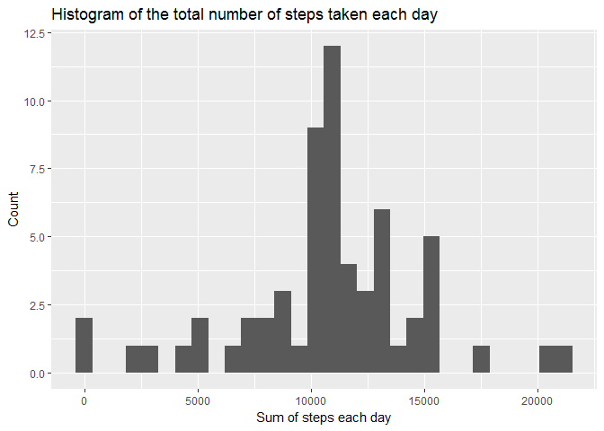
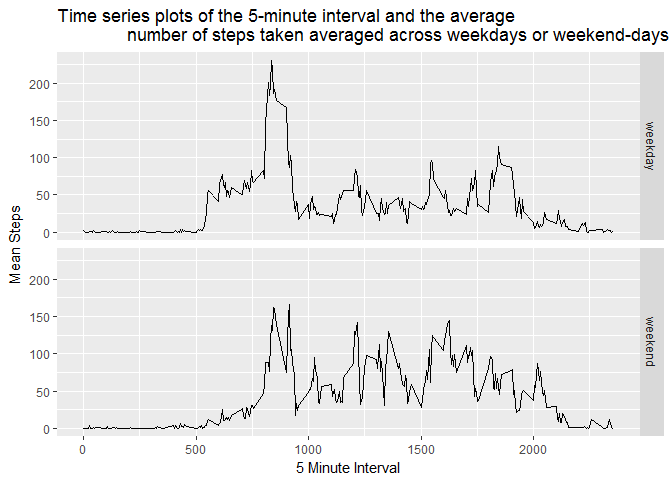

# ReproducibleResearchProject1
Federico Di Martino  
15 July 2017  


## Loading and preprocessing the data
Showing the code needed to:

1.Load the data

```r
library(ggplot2)
library(dplyr)
```

```
## 
## Attaching package: 'dplyr'
```

```
## The following objects are masked from 'package:stats':
## 
##     filter, lag
```

```
## The following objects are masked from 'package:base':
## 
##     intersect, setdiff, setequal, union
```

```r
activity <-read.csv("activity.csv")
```

2. Process the data into a format suitable for analysis

```r
##Convert date to character class since that's what strptime needs as an input
activity$date <- as.character(activity$date)


## Convert to POSIXct because dplyr does not work properly POSIXlt in this case
activity$date <- as.POSIXct(strptime(activity$date, "%Y-%m-%d"))
```

## What is mean total number of steps taken per day?

1. Calculate the total number of steps taken per day


```r
## Sum steps by date
StepsSummedByDate <- summarise(group_by(activity, date), sum(steps))

## Rename variable to avoid conflict with sum() function
names(StepsSummedByDate)[2] <- "sumofsteps"
```


2. Histogram of the total number of steps taken each day


```r
## Make a histogram of the total number of steps taken each day
g <- ggplot(data = subset(StepsSummedByDate, !is.na(sumofsteps)), aes(sumofsteps))
g <- g + geom_histogram()
g <- g + labs(title = "Histogram of the total number of steps taken each day",
              x = "Sum of steps each day", y = "Count")
g
```

```
## `stat_bin()` using `bins = 30`. Pick better value with `binwidth`.
```

<!-- -->


3. Calculate and report the mean and median of the total number of steps taken per day

```r
## Calculate mean steps per day
MeanStepsPerDay <- mean(StepsSummedByDate$sumofsteps, na.rm = TRUE)
MeanStepsPerDay
```

```
## [1] 10766.19
```

```r
##Calculate median steps per day
MedianStepsPerDay <- median(StepsSummedByDate$sumofsteps, na.rm = TRUE)
MedianStepsPerDay
```

```
## [1] 10765
```


The mean of the total number of steps taken per day is 1.0766189\times 10^{4}

The median of the total number of steps taken per day is 10765

## What is the average daily activity pattern?

1. Make a time series plot (i.e. type = "l") of the 5-minute interval (x-axis) and the average number of steps taken, averaged across all days (y-axis)


```r
## Calculate mean steps by interval
MeanStepsByInterval <- summarise(group_by(activity, interval), mean(steps, na.rm = TRUE))

## Set interval as numeric class
MeanStepsByInterval$interval <- as.numeric(MeanStepsByInterval$interval)

## Rename mean variable for tidyness' sake
names(MeanStepsByInterval)[2] <- "MeanSteps"

## Rearrange by interval
MeanStepsByInterval <- arrange(MeanStepsByInterval, interval)


## Time series plotof the 5-minute interval and the average number of steps 
## taken, averaged across all days

g <- ggplot(data = MeanStepsByInterval, aes(interval, MeanSteps))
g <- g + geom_line() 
g <- g + labs(title = "Time series plot of the 5-minute interval and the average 
              number of steps taken averaged across all days",
              x = "5 Minute Interval", y = " Mean Steps ")
g
```

<!-- -->


2. Which 5-minute interval, on average across all the days in the dataset, contains the maximum number of steps?


```r
## Identify maximum average steps in an interval
MaximumMeanSteps <- max(MeanStepsByInterval$MeanSteps)

## Identify which interval this corresponds to
IntervalWithMaxSteps <- MeanStepsByInterval$interval[MeanStepsByInterval$MeanSteps == MaximumMeanSteps]
```


The 5 minute interval containing the most steps on average is interval 835

## Imputing missing values


1. Calculate and report the total number of missing values in the dataset (i.e. the total number of rows with NAs)


```r
## Calculate the total number of missing values
NumberOfMissingValues <- sum(is.na(activity))
NumberOfMissingValues
```

```
## [1] 2304
```

The number of missing values is 2304


2.Devise a strategy for filling in all of the missing values in the dataset.

Strategy used will be to substitute each missing value with the average value for that interval over all days.

3. Create a new dataset that is equal to the original dataset but with the missing data filled in.


```r
### Impute mean of each interval to replace missing values in original data

## Join original data and interval means by interval
filledactivity <- inner_join(activity, MeanStepsByInterval, by="interval")

## Impute mean of each interval to replace missing values in original data
filledactivity <-  mutate(filledactivity,steps=ifelse(is.na(steps),MeanSteps,steps))

## Remove interval means column
filledactivity$MeanSteps <- NULL

## Check that all NA values are removed
sum(is.na(filledactivity))
```

```
## [1] 0
```


4. Make a histogram of the total number of steps taken each day and Calculate and report the mean and median total number of steps taken per day. Do these values differ from the estimates from the first part of the assignment? What is the impact of imputing missing data on the estimates of the total daily number of steps?


```r
## Sum steps by date
StepsSummedByDateFilled <- summarise(group_by(filledactivity, date), sum(steps))

## Rename variable to avoid conflict with sum() function
names(StepsSummedByDateFilled)[2] <- "sumofsteps"

## Make a histogram of the total number of steps taken each day
g <- ggplot(data = subset(StepsSummedByDateFilled, !is.na(sumofsteps)), aes(sumofsteps))
g <- g + geom_histogram()
g <- g + labs(title = "Histogram of the total number of steps taken each day",
              x = "Sum of steps each day", y = "Count")
g
```

```
## `stat_bin()` using `bins = 30`. Pick better value with `binwidth`.
```

<!-- -->

```r
## Calculate mean steps per day
MeanStepsPerDayFilled <- mean(StepsSummedByDateFilled$sumofsteps)
MeanStepsPerDayFilled
```

```
## [1] 10766.19
```

```r
##Calculate median steps per day
MedianStepsPerDayFilled <- median(StepsSummedByDateFilled$sumofsteps)
MedianStepsPerDayFilled
```

```
## [1] 10766.19
```

For the fille data, the mean of the total number of steps taken per day is 1.0766189\times 10^{4} and the median of the total number of steps taken per day is 1.0766189\times 10^{4}.


The mean total steps per day is the same as it was for the unfilled data whilst the median is slightly different from it's unfilled value and is now the same as the mean.


## Are there differences in activity patterns between weekdays and weekends?


1. Create a new factor variable in the dataset with two levels - "weekday" and "weekend" indicating whether a given date is a weekday or weekend day.


```r
## Identify whether each day is a weekday or part of the weekend
## Create function to do this
identify.weekday <- function(x) {
        day <- weekdays(x)
        if(day == "Saturday" | day == "Sunday"){
            daytype <- "weekend"
            return(daytype)
            
    }
        else{
            daytype <- "weekday"
            return(daytype)
    }
    
}


## Apply this function to the data and make the daytypes factors
filledactivity$daytype <- as.factor(sapply(filledactivity$date, identify.weekday))
```

2. Make a panel plot containing a time series plot (i.e. type = "l") of the 5-minute interval (x-axis) and the average number of steps taken, averaged across all weekday days or weekend days (y-axis). See the README file in the GitHub repository to see an example of what this plot should look like using simulated data.


```r
## Calculate mean steps by interval
MeanStepsByIntervalFilled <- summarise(group_by(filledactivity, interval, daytype), mean(steps))

## Set interval as numeric class
MeanStepsByIntervalFilled$interval <- as.numeric(MeanStepsByIntervalFilled$interval)

## Rename mean variable for tidyness' sake
names(MeanStepsByIntervalFilled)[3] <- "MeanSteps"

## Rearrange by interval
MeanStepsByIntervalFilled <- arrange(MeanStepsByIntervalFilled, interval)


## Time series plot of the 5-minute interval and the average number of steps 
## taken, averaged across all days

g <- ggplot(data = MeanStepsByIntervalFilled, aes(interval, MeanSteps))
g <- g + geom_line() + facet_grid(daytype ~.) 
g <- g + labs(title = "Time series plots of the 5-minute interval and the average 
              number of steps taken averaged across weekdays or weekend-days",
              x = "5 Minute Interval", y = " Mean Steps ")
g
```

<!-- -->

